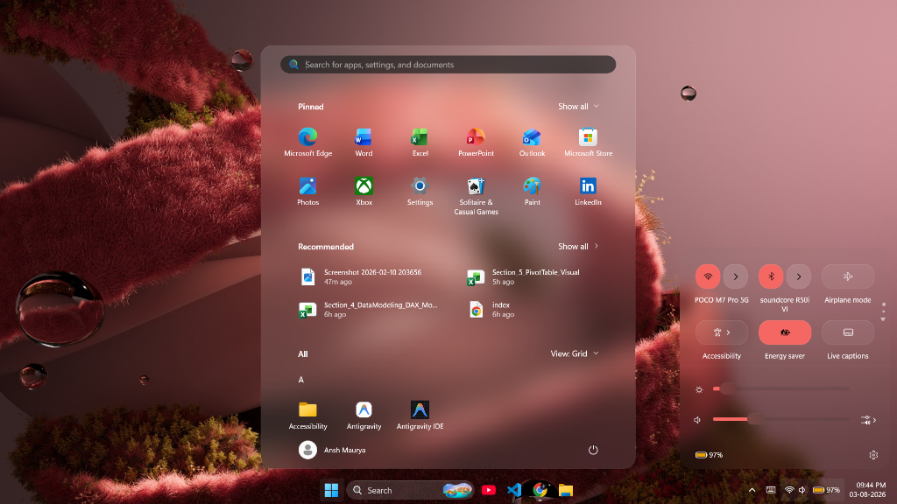
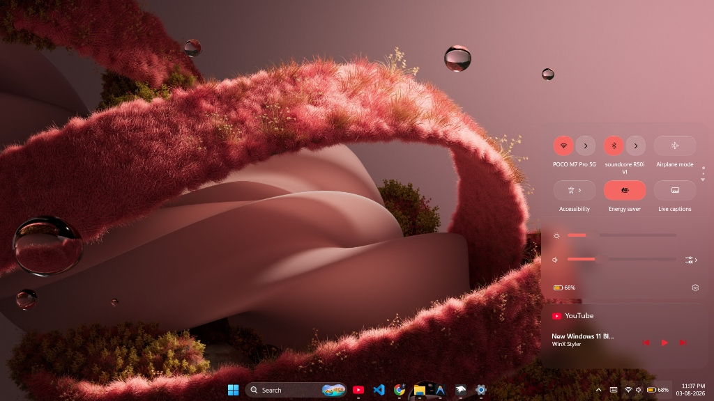
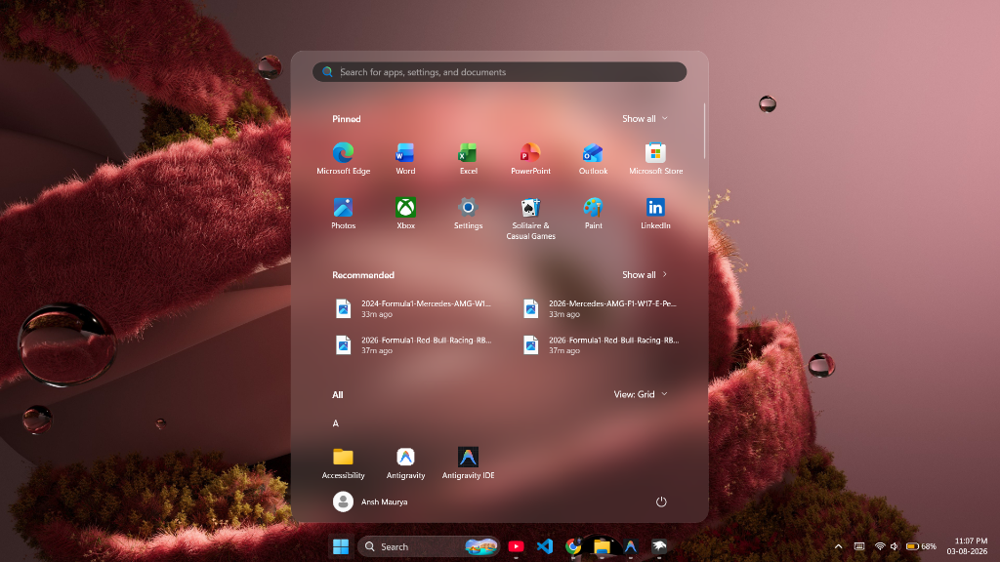

# Windows 11 Glassmorphism Customization Pack 🎨

A curated set of styling configurations for Windows 11 to give your **Start Menu**, **Notification Center**, and **Taskbar** a clean, modern **Glassmorphism (Acrylic / Blur)** aesthetic.

This pack uses **Windhawk** and **TranslucentTB** to deliver a premium look with minimal system resource usage.

---

## 🛠️ Prerequisites & Installation

### 1. Windhawk
- **What it does**: Customizes UI elements like the Start Menu and Notification Center.
- **Download**: [Official Windhawk Website](https://windhawk.net/)

### 2. TranslucentTB
- **What it does**: Makes your taskbar completely transparent.
- **Performance**: Extremely lightweight (uses only **~1 MB of RAM**).
- **Download**: Get it free on the [Microsoft Store](https://apps.microsoft.com/detail/9pf4kz2vn4w9).

---

## 🚀 How to Apply the Mods

Follow the quick steps below for each mod you want to enable.

> 📌 **Note**: You can apply just one or both mods depending on your preference!

---

### 🔹 1. Windows 11 Notification Center Styler
To apply custom styles to your Notification Center & Control Center:

1. Open **Windhawk**.
2. Go to the **Explore** tab, search for **Windows 11 Notification Center Styler**, and click **Details**.
3. Go to the **Advanced** tab -> **Settings**.
4. ⚠️ **Important Step**: Delete/remove any existing code inside the text box first.
5. Copy the code from [`notification_center_styler.json`](./notification_center_styler.json) and paste it into the box.
6. Click **Save Settings** to apply.

---

### 🔹 2. Windows 11 Start Menu Styler
To apply custom styles to your Start Menu:

1. Open **Windhawk**.
2. Go to the **Explore** tab, search for **Windows 11 Start Menu Styler**, and click **Details**.
3. Go to the **Advanced** tab -> **Settings**.
4. ⚠️ **Important Step**: Delete/remove any existing code inside the text box first.
5. Copy the code from [`start_menu_styler.json`](./start_menu_styler.json) and paste it into the box.
6. Click **Save Settings** to apply.

---

## 💡 How to Customize the Code Yourself

Want to change colors, transparency, blur amount, or rounded corners?

You can easily customize these styles to match your personal setup! Simply:
1. Copy the JSON code from [`notification_center_styler.json`](./notification_center_styler.json) or [`start_menu_styler.json`](./start_menu_styler.json).
2. Paste it into an AI like **Claude** or **ChatGPT**.
3. Tell the AI whatever changes you need (e.g. *"Increase the blur effect"*, *"Change tint color"*, or *"Make borders thinner"*).
4. Copy the modified code back into Windhawk!

---

## 📂 Repository Contents
- [`notification_center_styler.json`](./notification_center_styler.json) - Notification Center & Control Center styling configuration.
- [`start_menu_styler.json`](./start_menu_styler.json) - Start Menu styling configuration.
- [`assets/`](./assets/) - Preview screenshots and image assets.

---

## ⚠️ Tips & Notes
- Playing around with too many Windhawk mods at once can mess things up or cause instability. Sticking to these selected mods keeps your system running smoothly.
- Both configs have been tested for stability and performance on Windows 11.

---

## ⭐ Support
If this customization pack helped improve your Windows 11 setup, please give this repository a **Star** ⭐! It helps others find it too.
